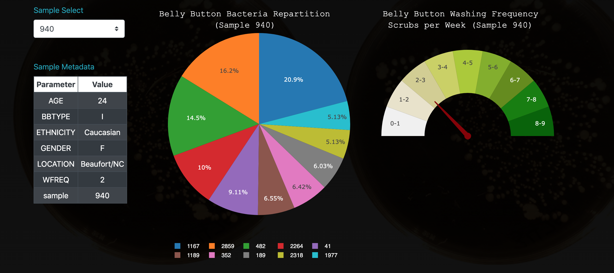
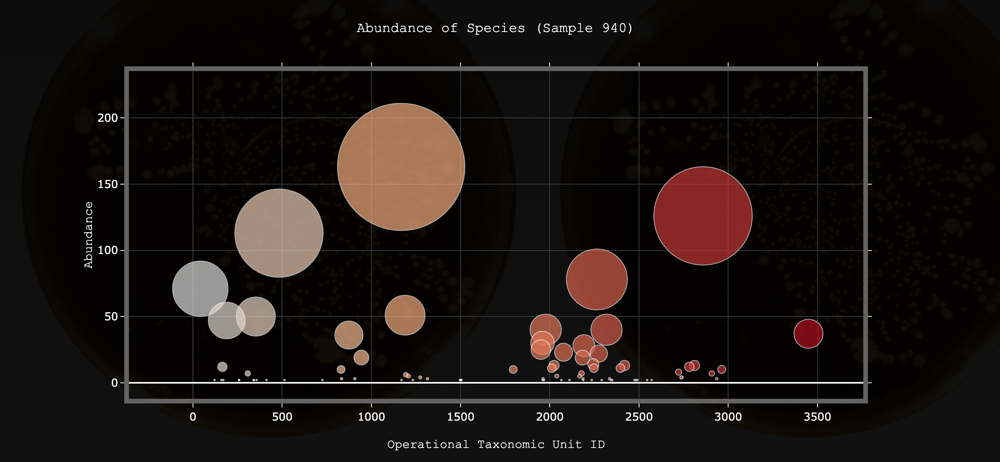

## Bacteria-Biodiversity
### Link : https://ln-plotly-project.herokuapp.com/

<p align="center">
  
  
  
</p>


## Objective:
The purpose of the The Bacteria Biodiversity project is to present the dataset from the sample taking as an interactive dashboard. This dataset contains the characteristics of the persons from whom the samples were taken, the various bacteria found near their belly button, the quantity of each of them as well as the navel washing frequency.

A table and three charts were built using Javascript and Plotly.
- The pie chart shows the first ten bacteria species for a sample id.
- The gauge chart shows the belly button washing frequency.
- The bubble chart shows all the species and their Operational Taxonomic Unit (OTU) ID.

This project also used Python, Flask, CSS, HTML and Bootstrap to explore the dataset.

## Python, Flask

The imports in app.py:

```python
import os
import pandas as pd
import numpy as np
import sqlalchemy
from sqlalchemy.ext.automap import automap_base
from sqlalchemy.orm import Session
from sqlalchemy import create_engine
from flask import Flask, jsonify, render_template
from flask_sqlalchemy import SQLAlchemy
```
In the app.py file, some Flask routes were built in order to take the informations from the sqlite files.
- To get the samples names, that will be useful for the dropdown:
```python
@app.route("/names")
def names():
    """Return a list of sample names."""

    # Use Pandas to perform the sql query
    stmt = db.session.query(Samples).statement
    df = pd.read_sql_query(stmt, db.session.bind)

    # Return a list of the column names (sample names)
    return jsonify(list(df.columns)[2:])
```

- To get the metadata for each sample, build the table and also the gauge chart using Samples_Metadata.WFREQ:
```python
@app.route("/metadata/<sample>")
def sample_metadata(sample):
    """Return the MetaData for a given sample."""
    sel = [
        Samples_Metadata.sample,
        Samples_Metadata.ETHNICITY,
        Samples_Metadata.GENDER,
        Samples_Metadata.AGE,
        Samples_Metadata.LOCATION,
        Samples_Metadata.BBTYPE,
        Samples_Metadata.WFREQ,
    ]

    results = db.session.query(*sel).filter(Samples_Metadata.sample == sample).all()

    # Create a dictionary entry for each row of metadata information
    sample_metadata = {}
    for result in results:
        sample_metadata["sample"] = result[0]
        sample_metadata["ETHNICITY"] = result[1]
        sample_metadata["GENDER"] = result[2]
        sample_metadata["AGE"] = result[3]
        sample_metadata["LOCATION"] = result[4]
        sample_metadata["BBTYPE"] = result[5]
        sample_metadata["WFREQ"] = result[6]

    print(sample_metadata)
    return jsonify(sample_metadata)
 ```
    
- To get the data for each sample, build the pie chart and the bublle chart:

 ```python
  @app.route("/samples/<sample>")
  def samples(sample):
    """Return `otu_ids`, `otu_labels`,and `sample_values`."""
    stmt = db.session.query(Samples).statement
    df = pd.read_sql_query(stmt, db.session.bind)

    # Filter the data based on the sample number and
    # only keep rows with values above 1
    sample_data = df.loc[df[sample] > 1, ["otu_id", "otu_label", sample]]

    # Sort by sample
    sample_data.sort_values(by=sample, ascending=False, inplace=True)

    # Format the data to send as json
    data = {
        "otu_ids": sample_data.otu_id.values.tolist(),
        "sample_values": sample_data[sample].values.tolist(),
        "otu_labels": sample_data.otu_label.tolist(),
    }
    return jsonify(data)
```
## Javascript, Plotly

The function init() is called when the app is launched and append the sample names to the dropdown. The function calls also the functions to build the charts using the first sample value.

```js
function init() {
  // Grab a reference to the dropdown select element
  var selector = d3.select("#selDataset");

  // Use the list of sample names to populate the select options
  d3.json("/names").then((sampleNames) => {
    sampleNames.forEach((sample) => {
      selector
        .append("option")
        .text(sample)
        .property("value", sample);
    });

    // Use the first sample from the list to build the initial plots
    const firstSample = sampleNames[0];
    console.log(firstSample.WFREQ)
    buildCharts(firstSample);
    buildMetadata(firstSample);
    buildGauge(firstSample);
  });
}
```
The function optionChanged is called when the value seclected in the dropdown change.
```js
function optionChanged(newSample) {
  // Fetch new data each time a new sample is selected
  buildCharts(newSample);
  buildMetadata(newSample);
  buildGauge(newSample);
}
```
optionChanged in html:
```html
<select class="custom-select button-primary" id="selDataset" onchange="optionChanged(this.value)"></select>
```

- Build the table:
```js
function buildMetadata(sample) {

  // Use d3 to select the panel with id of `#sample-metadata`
  var table = d3.select("#sample-metadata").html("").append("table");
  var thead = table.append("thead");
  var trow = thead.append("tr")
  trow.append("th").text("Parameter");
  trow.append("th").text("Value");
  var tbody = table.append("tbody");

  // Use `d3.json` to fetch the metadata for a sample
  d3.json(`/metadata/${sample}`).then(function(data) {
  console.log(data);
  
    // Use `Object.entries` to add each key and value pair to the table
    Object.entries(data).forEach(([key, value]) => {
    console.log(`key: ${key}, value: ${value}`);
    var row = tbody.append("tr");
    row.append("td").text(key);
    row.append("td").text(value);
    table.attr("class", "table table-bordered text-center thead-light table-dark table-hover table-sm table-striped");
    
    });
  });
};
```
- Build the bubble chart
```js
// Build a Bubble Chart using the sample data
    var trace1 = {
      x: otuIds,
      y: sampleValues,
      text: textValues,
      mode: 'markers',
      marker: {
        color: otuIds,
        size: sampleValues,
        colorscale: "Earth"
      }
    };
    
    var data = [trace1];
    
    var layout = {
      title: {
        text: `Abundance of Species (Sample ${sample})`,
        font: {
          family: 'Courier New, monospace',
          size: 18,
          color: '#fff',
        },
      }, 
      paper_bgcolor:'rgba(0,0,0,0)',
      plot_bgcolor:'rgba(0,0,0,0)',
      xaxis: {
        title: {
          text: `Operational Taxonomic Unit ID`,
          font: {
            family: 'Courier New, monospace',
            size: 16,
            color: '#fff',
          },
        },
        showgrid: true,
        zeroline: true,
        showline: true,
        mirror: 'ticks',
        tickcolor: '#fff',
        tickfont: {
          size: 14,
          color: 'rgba(255,255,255,1)'
        },
        gridcolor: '#343a40',
        gridwidth: 1,
        linecolor: '#636363',
        linewidth: 6
      },
      yaxis: {
        title: {
          text: `Abundance`,
          font: {
            family: 'Courier New, monospace',
            size: 16,
            color: '#fff',
          },
        },  
        mirror: 'ticks',
        tickcolor: '#fff',
        tickfont: {
          size: 14,
          color: 'rgba(255,255,255,1)'
        },
        zerolinecolor: '#fff',
        zerolinewidth: 2,
        gridcolor: '#343a40',
        gridwidth: 1,
        linecolor: '#636363',
        linewidth: 6
      },
      showlegend: false,
      height: 600,
      width: 1100
    };
    
    Plotly.newPlot("bubble", data, layout);
```

- Build the pie chart
```js
// Build a Pie Chart with the top 10 sample_values, otu_ids, and labels.
    let otuIds10 = otuIds.slice(0,10);
    let sampleValues10 = sampleValues.slice(0,10);
    let textValues10 = textValues.slice(0,10);

    var trace1 = {
      labels: otuIds10,
      values: sampleValues10,
      hovertext: textValues10,
      hoverinfo: 'hovertext',
      type: 'pie'
    };
    var data = [trace1];
    var layout = {
      title: {
        text: `Belly Button Bacteria Repartition<br>(Sample ${sample})`,
        font: {
          family: 'Courier New, monospace',
          size: 18,
          color: '#fff',
        },
      },
      margin: {
        l: 90,
        r: 30,
        b: 50,
        t: 50,
        pad: 0
      },
      paper_bgcolor:'rgba(255,255,255,0)',
      plot_bgcolor:'rgba(255,255,255,0)',
      autosize: false,
      height: 550,
      width: 500,
      legend: {
      orientation: "h",
      font: {
        family: 'sans-serif',
        size: 12,
        color: '#fff'
      }},
    };
    var PIE = document.getElementById("pie");
    Plotly.newPlot(PIE, data, layout);
  });
};
```

- Build the gauge chart
```js
// Build a Gauge Chart using the sample data

function buildGauge(sample) {

    // Use `d3.json` to fetch the sample data for the gauge chart
    d3.json(`/metadata/${sample}`).then(function (data) {
    var WFREQ = data.WFREQ;
    console.log(WFREQ);
    var degrees = 180 - WFREQ * 20,
        radius = .5;
    var radians = degrees * Math.PI / 180;
    var x = radius * Math.cos(radians);
    var y = radius * Math.sin(radians);
    var path1 = (degrees < 45 || degrees > 135) ? 'M -0.0 -0.025 L 0.0 0.025 L ' : 'M -0.025 -0.0 L 0.025 0.0 L ';
    var mainPath = path1,
        pathX = String(x),
        space = ' ',
        pathY = String(y),
        pathEnd = ' Z';
    var path = mainPath.concat(pathX, space, pathY, pathEnd);
    var data = [{
        type: 'scatter',
        x: [0], y: [0],
        marker: { size: 14, color: '850000' },
        showlegend: false,
        name: 'Washing Frequency',
        hoverinfo: 'text+name'
    },
    {
        values: [
            50 / 9,
            50 / 9,
            50 / 9,
            50 / 9,
            50 / 9,
            50 / 9,
            50 / 9,
            50 / 9,
            50 / 9,
            50
        ],
        rotation: 90,
        text: [
            "8-9",
            "7-8",
            "6-7",
            "5-6",
            "4-5",
            "3-4",
            "2-3",
            "1-2",
            "0-1",
            ""
        ],
        textinfo: "text",
        textposition: "inside",
        marker: {
            colors: [
                "rgba(0, 100, 0, 1)",
                "rgba(14, 127, 0, 1)",
                "rgba(100, 140, 15, 1)",
                "rgba(130, 175, 30, 1)",
                "rgba(170, 202, 42, 1)",
                "rgba(202, 209, 95, 1)",
                "rgba(210, 206, 145, 1)",
                "rgba(232, 226, 202, 1)",
                "rgba(240, 240, 240, 1)",
                "rgba(0, 0, 0, 0)"
            ]
        },
        labels: [
            "8-9",
            "7-8",
            "6-7",
            "5-6",
            "4-5",
            "3-4",
            "2-3",
            "1-2",
            "0-1",
            ""
        ],
        hoverinfo: "label",
        hole: .5,
        type: "pie",
        showlegend: false
    }];

    var layout = {
        label: {
            color: '#000'
        },
        title: {
            text: `Belly Button Washing Frequency<br>Scrubs per Week (Sample ${sample})`,
            font: {
              family: 'Courier New, monospace',
              size: 18,
              color: '#fff',
            },
        },
        margin: {
            l: 60,
            r: 30,
            b: 0,
            t: 50,
            pad: 0
          },
        paper_bgcolor:'rgba(0,0,0,0)',
        plot_bgcolor:'rgba(0,0,0,0)',
        shapes: [{
            type: 'path',
            path: path,
            fillcolor: '850000',
            line: {
                color: '850000'
            }
        }],
        height: 500,
        width: 450,
        xaxis: {
            zeroline: false, showticklabels: false,
            showgrid: false, range: [-1, 1]
        },
        yaxis: {
            zeroline: false, showticklabels: false,
            showgrid: false, range: [-1, 1]
        }
    };

    Plotly.newPlot("gauge", data, layout);

    });
};
