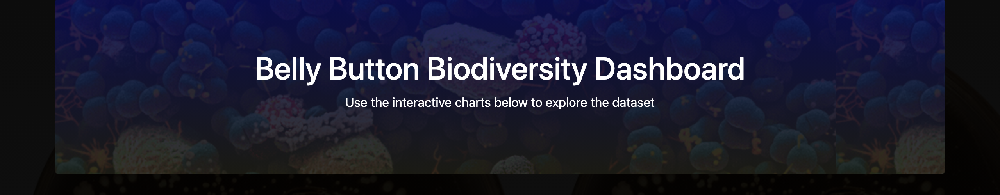

## Bacteria-Biodiversity
### Link : https://ln-plotly-project.herokuapp.com/

  
  
  

## Objective:
The purpose of the The Bacteria Biodiversity project is to present the dataset from the sample taking as an interactive dashboard. This dataset contains the characteristics of the persons from whom the samples were taken, the various bacteria found near their belly button, the quantity of each of them as well as the navel washing frequency.
